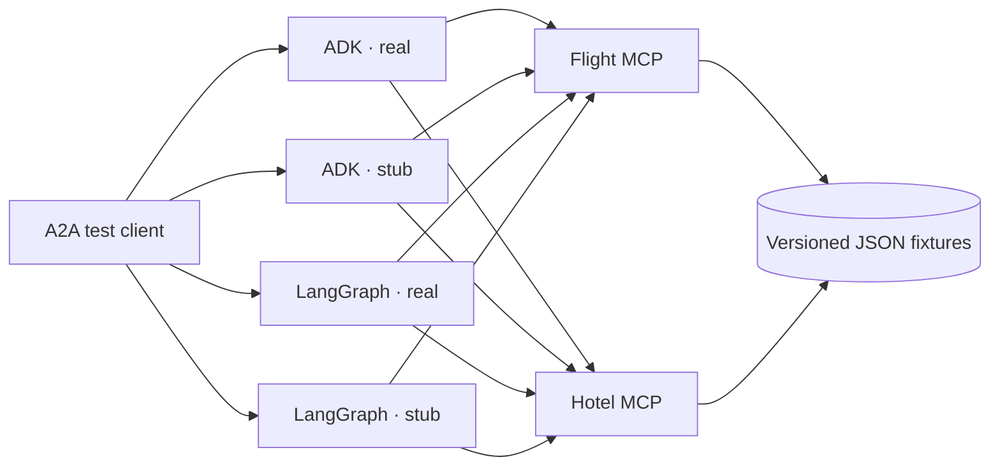

# A2A Travel Playground

[](https://github.com/shashikanth-gs/flight-hotel-mcp-a2a-agents/actions/workflows/ci.yml)
[](https://github.com/shashikanth-gs/flight-hotel-mcp-a2a-agents/actions/workflows/publish-containers.yml)
[](LICENSE)

A small, reproducible interoperability playground for the
[Agent2Agent (A2A) Protocol](https://a2a-protocol.org/) and the
[Model Context Protocol (MCP)](https://modelcontextprotocol.io/).

The same deterministic flight and hotel tools are exposed to agents implemented with Google ADK
and LangGraph. Each agent can run with a real NVIDIA NIM model or a free LiteLLM-backed stub,
giving you four A2A endpoints from two agent codebases.

The flight and hotel servers are general-purpose MCP fixtures, not A2A-specific components. Any
compatible MCP client can use them directly; the included A2A agents are example consumers.

> **Project status: Beta.** This repository is intended for protocol testing, demonstrations, and
> integration development. It is not a booking engine and must not be used as a source of live
> travel availability or prices.

## What runs

| Service | Local endpoint | Model | Limit |
|---|---|---|---|
| Flight MCP | `http://localhost:4301/mcp` | None | None |
| Hotel MCP | `http://localhost:4302/mcp` | None | None |
| ADK real | `http://localhost:4201` | NVIDIA NIM via LiteLLM | 1 invocation/minute |
| LangGraph real | `http://localhost:4202` | NVIDIA NIM via LiteLLM | 1 invocation/minute |
| ADK stub | `http://localhost:4203` | Deterministic LiteLLM mock | Unlimited |
| LangGraph stub | `http://localhost:4204` | Deterministic LiteLLM mock | Unlimited |

Every agent publishes an Agent Card at `/.well-known/agent-card.json`. Both implementations
support A2A JSON-RPC; the LangGraph implementation also exposes A2A HTTP+JSON under `/rest`.
The MCP services use Streamable HTTP at `/mcp`.

## Published Docker images

| Image | Purpose | Docker Hub |
|---|---|---|
| `shashikanthg/flight-hotel-mcp-server` | Flight and hotel MCP fixture servers | [](https://hub.docker.com/r/shashikanthg/flight-hotel-mcp-server) |
| `shashikanthg/flight-hotel-a2a-adk` | Google ADK A2A agent | [](https://hub.docker.com/r/shashikanthg/flight-hotel-a2a-adk) |
| `shashikanthg/flight-hotel-a2a-langgraph` | LangGraph A2A agent | [](https://hub.docker.com/r/shashikanthg/flight-hotel-a2a-langgraph) |

Default-branch images support Linux AMD64 and ARM64:

```bash
docker pull shashikanthg/flight-hotel-mcp-server:main
docker pull shashikanthg/flight-hotel-a2a-adk:main
docker pull shashikanthg/flight-hotel-a2a-langgraph:main
```

Version tags publish semantic-version aliases and `latest`. See
[publishing container images](docs/publishing-containers.md) for the tag policy and the
[copy-ready Docker Hub Overviews](docs/dockerhub/README.md) for repository descriptions.

## Architecture



Real and stub are runtime modes, not duplicate implementations. Compose builds one image per
framework and starts that image with different configuration.

## Fixture dataset at a glance

The MCP services use a manually curated, versioned JSON fixture catalog, not a live or
third-party travel dataset. It is primarily India-centric, with a small set of outbound
international routes.

| Coverage | Included |
|---|---|
| Airports | 16: 8 in India and 8 international |
| Flights | 15 templates across 14 directional routes |
| Hotels | 12 properties across 10 cities |
| Prices | Simulated Indian rupee (INR) values |
| Dates | Any valid ISO calendar date; fixture times and prices are projected onto it |

Airport identities describe real places, but schedules, availability, properties, and prices are
fictional and cannot be booked. See the [fixture dataset contract](docs/data-and-limitations.md)
for the exact airports, routes, hotel cities, date behavior, and unsupported-query behavior.

## Quick start

Prerequisites: Docker with Compose v2. No API key is required for the stub playground.

```bash
cp .env.example .env
docker compose up --build flight-mcp hotel-mcp adk-stub langgraph-stub
```

Try either stub Agent Card:

```bash
curl http://localhost:4203/.well-known/agent-card.json
curl http://localhost:4204/.well-known/agent-card.json
```

Example requests for an A2A client:

```text
Find flights from DEL to BOM on 2030-01-15 for 2 adults.
Find flights from Delhi to Dubai on 2030-02-01.
Find hotels in Mumbai from 2030-01-15 to 2030-01-18 for 2 guests.
List the supported fixture routes.
```

To run the real agents, add `NVIDIA_NIM_API_KEY` to `.env` and start the real services:

```bash
docker compose up --build flight-mcp hotel-mcp adk-real langgraph-real
```

See [local development](docs/local-development.md) for native Python setup and probe commands.

## Repository layout

```text
.
├── agents/
│   ├── adk/                 # Google ADK A2A implementation
│   └── langgraph/           # LangGraph A2A implementation
├── charts/                  # Helm chart for Kubernetes deployment
├── mcp-servers/             # Flight and hotel MCP entry points plus fixture data
├── docs/                    # Architecture, configuration, deployment, and data notes
├── .github/                 # CI, dependency updates, and contribution templates
├── compose.yaml             # Complete six-service local topology
└── Makefile                 # Repeatable contributor commands
```

Each Python application has its own `pyproject.toml` and `uv.lock`. This is deliberate: the MCP
servers use the current MCP Python SDK while framework adapters may require a different compatible
client version.

## Documentation

- [Architecture and design decisions](docs/architecture.md)
- [Framework compatibility notes](docs/compatibility.md)
- [Configuration reference](docs/configuration.md)
- [Local development](docs/local-development.md)
- [Deployment guide](docs/deployment.md)
- [Helm chart](charts/flight-hotel-mcp-a2a/README.md)
- [Publishing container images](docs/publishing-containers.md)
- [Fixture data and limitations](docs/data-and-limitations.md)
- [Contributing](CONTRIBUTING.md)
- [Security policy](SECURITY.md)

## Safety and scope

Airport identities and IATA codes describe real places. All flight schedules, flight numbers,
inventory, hotels, availability, and prices are simulated. Responses are deterministic and cannot
be booked.

The playground intentionally has no authentication. Bind it to localhost for development. Before
placing it on the public internet, follow the controls in the [deployment guide](docs/deployment.md).

## License

Licensed under the [Apache License 2.0](LICENSE).
